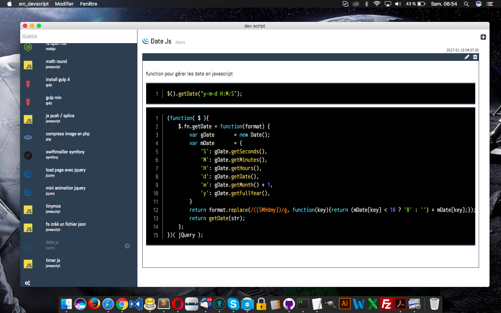
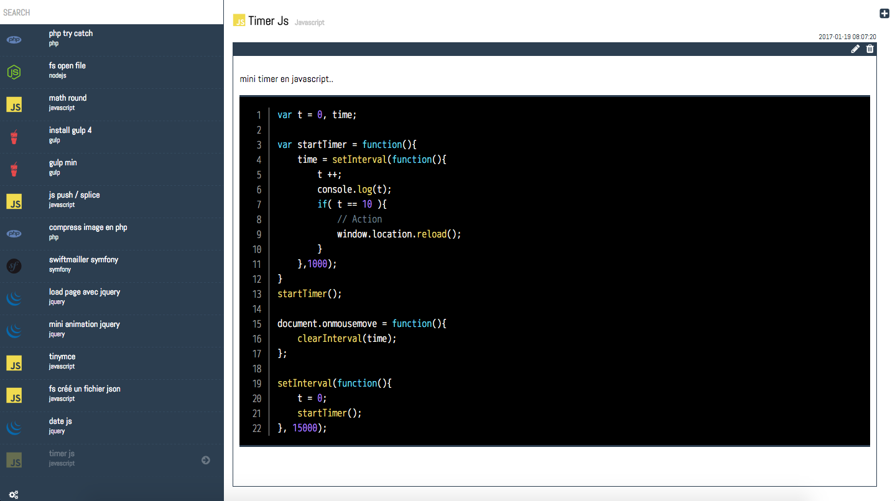

# DEVSCRIPT

MacOs beta version..
Memorise your dev script





### Prerequisites

What things you need to install the software and how to install them

```
...
```

### Installing

Clone this repo, and look help section..


## Deployment

Beta version ..

## Built With

* [nw.js](https://nwjs.io/) - The js framework used

## Dependencies

```
* devicon: 2.0.0
* fs: 0.0.1-security
* fs-extra": 2.0.0
* gulp: github:gulpjs/gulp#4.0
* gulp-clean-css: 2.3.2
* gulp-concat-css: 2.3.0
* gulp-uglifyjs: 0.6.2
* gulp-watch: 4.3.11
* shell_exec: 1.0.3
```

## Versioning

We use [Github](https://github.com) for versioning. For the versions available, see the [tags on this repository](https://github.com/bantioco/nwjs_dev_scripts).

## Authors

* **Antioco benjamin** - *Initial work* - [Bantioco](https://github.com/bantioco)


## License

This project is licensed under the MIT License - see the [LICENSE.md](LICENSE.md) file for details

